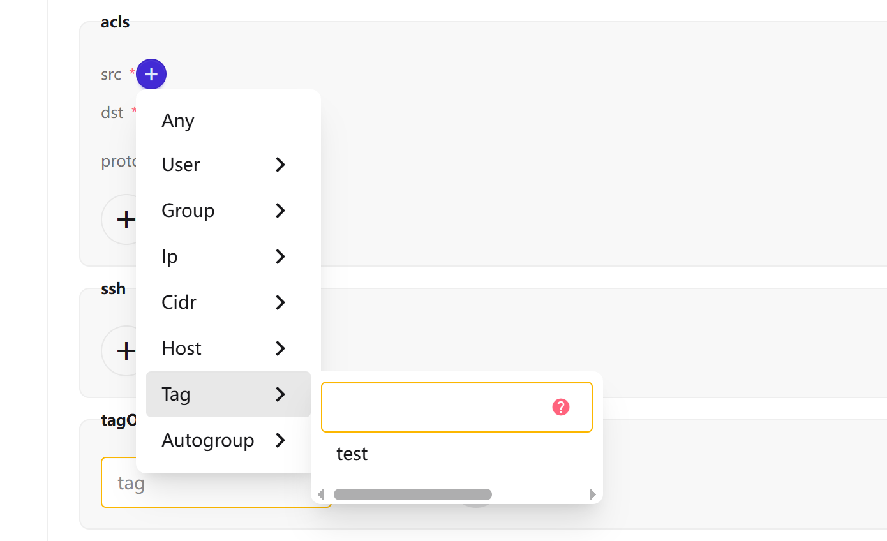
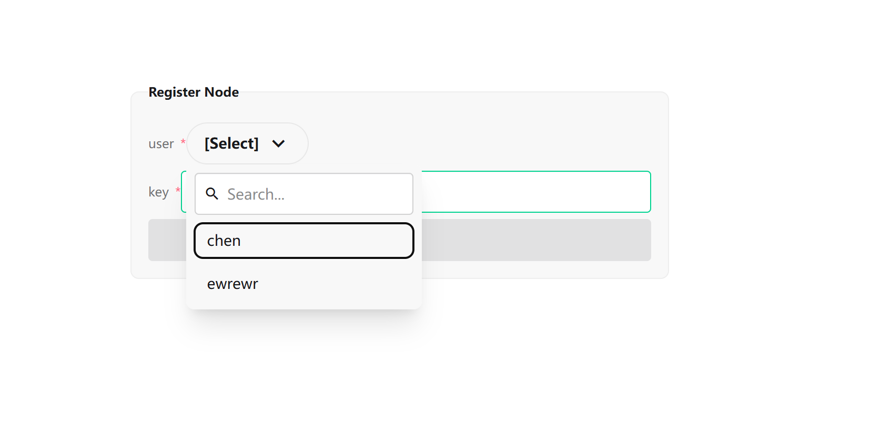
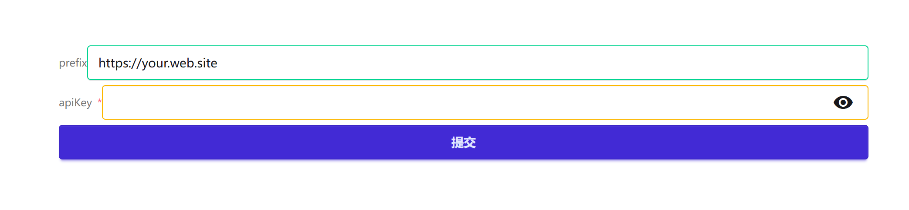

# HeadscalePiying

- This project is a web UI for [headscale](https://github.com/juanfont/headscale).
- Currently supports version `0.28.0`.

## Project Features

- Uses the official API definition file [gen/openapiv2/headscale/v1/headscale.swagger.json](https://github.com/juanfont/headscale/blob/main/gen/openapiv2/headscale/v1/headscale.swagger.json) for easy maintenance.
- Implements a visual ACL configuration interface with auto-suggestion support.




- Supports deployment via [Traefik](./docs/server-config/readme.md) and temporary hosting on [GitHub Pages](https://wszgrcy.github.io/headscale-piying).

### Traefik Deployment

- [Traefik deployment guide](./docs/server-config/readme.md)
- Enables automatic redirection for Tailscale links:

```bash
root@ubuntu:~# sudo tailscale up --login-server=your.web.site

To authenticate, visit:

        https://your.web.site/register/xxxxxx-yyyyyyyyyyyyyyyy
```



### Temporary GitHub Pages Hosting

- [GitHub Pages](https://wszgrcy.github.io/headscale-piying)
- If your server allows CORS, you can host the web UI remotely without local deployment. The only limitation is that link redirection won't work — manual registration is required.

- In Traefik, configure a CORS middleware as follows:

```yaml
cors:
  headers:
    accessControlAllowMethods:
      - GET
      - OPTIONS
      - PUT
      - POST
      - PATCH
      - DELETE
    accessControlAllowHeaders: '*'
    accessControlAllowOriginList:
      - https://wszgrcy.github.io
    accessControlMaxAge: 100
    addVaryHeader: true
```

- type `server_url`

